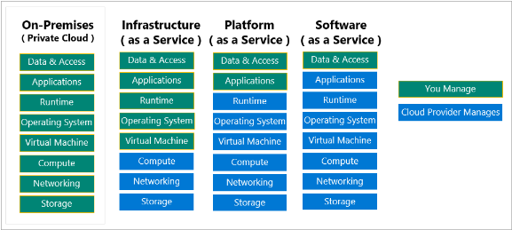

# Cloud concepts

## Cloud computing

#### Concept

It's the delivery of computing services over the internet, which is otherwise known as the cloud. Offers faster innovation, flexible resources and economies of scale.

It's cheaper because uses a pay-as-you-go pricing model. You typically pay only for the cloud services you use which helps you: lower operating costs, efficiency, scale.

If you move to the cloud you will be able to deliver new features to the users at record speeds, users expect an increasingly rich and immersive experience with their devices and with software.

## Azure

#### Concept

Azure is a continually expanding set of cloud services that help your organization meet your current and future business challenges.

#### What does Azure offer?

- Be ready for the future
- Build on your terms
- Operate hybrid seamlessly
- Trust your cloud

#### How does Azure work?

Azure Portal --> API --> Orchestrator --> Switch --> Fabric controller --> Racks (servers)

#### What is the Azure Portal?

Web-based, unified console that provides an alternative to command-line tools.

- Build, manage and monitor everything
- Create custom dashboards for an organized view of resources
- Configure accessibility options for an optimal experience.

It's designed for resiliency and continuous availability. It maintains presence in every Azure datacenter. This configuration makes it resilient to individual failures and avoids network slowdowns by being close to users. The Azure portal updates continuously and requires no downtime for maintenance activities.

#### What is Azure marketplace?

Connects with Microsoft partners, independent software vendors and startups that are offering solutions and services optimized to run on Azure. Here you can find, purchase or provision applications and services.

Its target are IT pros and cloud developers interested in commercial and IT software.

#### Azure services

1. Compute: scale on demand while only paying what you use. Add VM or scale web and mobile apps.
2. Networking: connect your own cloud and on-premise infrastructure. Examples: VPN and load balancing
3. Storage: Disk, file, blob or archival storage.
   - **Durable** and highly available with redundancy and replication.
   - **Secure** through automatic encryption and role-based access control.
   - **Scalable** with virtually unlimited storage.
   - **Managed**, handling maintenance and any critical problems for you.
   - **Accessible** from anywhere in the world over HTTP or HTTPS.
4. Mobile: build and deploy cross-platform and native apps, notifications, Xamarin to build cloud-powered apps.
5. Databases: Proprietary and open-source engines: SQL, Cosmos DB, MySQL, Mongo DB
6. Web: build, deploy, manage and scale. Create web apps, publish API or use Azure Maps.
7. IoT: Connect, monitor and manage all your IoT assets. Analyze data from sensors.
8. Big data: Open source cluster services to help run analytics and make decisions based off of complex queries.
9. AI: Use existing data to forecast future behaviors. Use machine learning to build, train and deploy models to the cloud.
10. DevOps: Brings together people, processes and technology by automating software delivery.

#### Azure accounts

After you've created an Azure Account, you're free to create additional subscriptions, after you've created an Azure subscription you can start creating Azure resources.

You can purchase Azure access directly from Microsoft by signing up or though a representative. You can also purchase through a Microsoft partner.

An Azure free account includes:

- Access to popular products for 12 months.
- A credit for the first 30 days.
- Access to more than 25 products that are always free.

To sign up you need a phone number, a credit card and a Microsoft account or a GitHub account.

## Azure concepts

#### Deployment Models

Public Cloud (Cloud-Native), Private Cloud (On-premise), Hybrid (both On-Premise and CSP, ExpressRoute).

#### CapEx vs OpEx

CapEx is the up-front spending of money on physical infrastructure. OpEx is spending money on services or products now and being billed for them now, there is no up-front, you pay as you use.

#### Cloud service models

| IaaS                                                        | PaaS                                                  | SaaS                                                         |
| ----------------------------------------------------------- | ----------------------------------------------------- | ------------------------------------------------------------ |
| The most flexible cloud service.                            | Focus on application development.                     | Pay-as-you-go pricing model.                                 |
| You configure and manage the hardware for your application. | Platform management is handled by the cloud provider. | Users pay for the software they use on a subscription model. |

#### Questions

1. Which of the following is a logical unit of Azure services that links to an Azure account?

   - Management group
   - Resource group
   - Azure subscription

   Explanation

   An Azure subscription is a logical unit of Azure services that links to an Azure account.

   

2. Which of the following statements is true?

   - With Operating Expenses (OpEx), you are only responsible for the computing resources that you use.
   - With Operating Expenses (OpEx), you are responsible for purchasing and maintaining your computing resources.
   - With Capital Expenses (CapEx), you are only responsible for the computing resources that you use.

   Explanation

   With Operating Expenses (OpEx), you are only responsible for the computing resources that you use.

# Core Azure Services

## Core Azure  architectural components

Management groups --> Subscriptions --> Resource groups --> Resources

#### Azure regions, availability zones and region pairs

Instead of expose the physical resource to the user, Azure organize them into regions. Some regions offer availability zones.

#### Regions

It's a geographical area that contains at least one but potentially multiple datacenters that are nearby and networked together. When you deploy a resource you often choose the region.

**Important:** Some services or VM features are only available in certain regions, such as specific VM sizes or storage types. There are also some global Azure services that don't require you to select a particular region, such as Azure Active Directory, Azure Traffic Manager, and Azure DNS.

#### Special Azure regions

US DoD Central, US Gov Virginia, US Gov Iowa and more: these regions are physical and logical network-isolated instances of Azure for US government.

China East, north and more: these regions are available though a particular partnership with 21Vianet.

#### Availability zones

Azure sets redundancy through availability zones.

These are physically separate datacenters within an Azure region. Each is made up of one or more independent datacenters, it's set up to be an isolation boundary. They are connected through high-speed private fiber-optic networks. If you create resources that want to be redundant you need to duplicate them.

These are primary provided for VMs, managed disks, load balancers and SQL databases, there are two categories:

- Zonal services: you pin the resource to a specific zone. Ej.: VMs, IP addresses, managed disks
- Zone-redundant services: the platform replicates automatically across zones. Ej.: SQL database, zone-redundant storage.

#### Azure region pairs

Each Azure region is always paired with another region within the same geography at least 300 miles away.

## Azure resources, resource groups and ARM

- Resource groups: logical container for resources, a resource can only be a member of a group, many of them can be moved. Resource groups can't be nested.

- Authorization: are also scope for applying RBAC.

- ARM: deployment and management service for Azure. Enables you to create, update and delete resources.

  APIs/SDKs (request) --> ARM (authorization) --> Azure service (action)

## Azure subscriptions and management groups

#### Azure subscriptions

Is a logical unit that links to an account, which is an identity in Azure AD or in a directory that Azure AD trusts. An account can have more than one subscription with different billing models and to which apply different access-management policies. You can use subscriptions to define boundaries around Azure products, services and resources.

- Billing boundary: multiple subscriptions for different types of billing requirements
- Access control boundary: for example: different departments

#### Management groups

Provide a level of scope above subscriptions.  You organize subscriptions into containers called management groups and apply governance conditions to those groups. All subscriptions within the same management group must trust the same Azure AD tenant.

## Azure Workload products

#### Compute services

- VMs, VMs scale sets, Container Instances and Kubernetes Service, App Service, Azure Functions (or serverless  computing)

#### Scale VMs

- Scales sets: group of identical, load-balanced VMs.
- Azure batch: enables large-scale parallel and high-performance computing (HPC) batch jobs

#### App Services

- Web apps, API apps, WebJobs (run programs), Mobile apps (quickly build back-end for iOS and Android).

#### Container Services

A virtualization environment where you don't manage the OS, it's a PaaS. For example: Docker.

#### Kubernetes Services

Is a complete orchestration services for containers. For automating, managing and interacting with containers.

#### Azure Functions and logic apps

They implement **serverless compute**, which is the abstractions of servers, infrastructure and OSs. Characteristics:

- Abstraction of servers, Event-driven scale (triggers -HTTP, API and webhook-, timers, queues, etc) and Micro-Billing (only charge for the exact execution time).

#### Azure functions

When you are concerned only about the code running your service and not the underlaying PaaS or IaaS. 

They can be managed through REST API or VS, can run locally or in the cloud, developed code-first (imperative), monitored through Application Insights.

#### Azure Logic Apps

Similar to functions, both enable you to trigger logic on an event. But logic apps executes workflows that are designed to automate business scenarios and are built from predefined login blocks. Logic apps are defined through a GUI.

They can be managed through Azure Portal, REST API, PowerShell or VS, run only in the cloud, developed designer-first (declarative), monitored through Azure Portal or Log analytics.

## Azure networking services

Virtual Network allows you to create multiple isolated networks. A VM can connect to the internet by default, you can configure this by defining public IPs or a public load balancer. For VM management you can connect via CLI, Remote Desktop Protocol or SecureShell.

#### Communicate between resources

Virtual networks or service endpoints (allows you to connect multiple resources to virtual networks).

#### Communicate networks (also Azure VPM Gateways)

- Point-to-site virtual private networks: devices to virtual networks.
- Site-to-site virtual private networks: on-premises datacenters with virtual networks, the devices in Azure can appear as being on the local network.
- Network-to-network: virtual network to virtual network.
- Azure ExpressRoute: dedicated connectivity to Azure.

#### Types of VPNs

- Policy-based: filter what packaged to be encrypted by filtering the IP addresses of packages
- Route-based VPNs: tunnels are modeled as a network interface or virtual tunnel interface, so it decides what tunnel use for the packages.

#### Routers

Route tables (subnets of virtual networks) and Border Gateway Protocol (BGP - between on-promises to virtual networks).

#### ExpressRoute

Models: CloudExchange (to Microsoft Cloud), point-to-point (to Azure) and any-to-any (private WAN to Azure).

#### Questions

1. Your company has a team of remote workers that need to use Windows-based software to develop your company's applications, but your team members are using various operating systems like MacOS, Linux, and Windows. Which Azure compute service would help resolve this scenario?

   - Azure App Service
   - Windows Virtual Desktop
   - Azure Container Instances

   Explanation

   That's correct. Windows Virtual Desktop enables your team members to run Windows in the cloud, with access to the required applications for your company's needs.

2. Tailwind Traders uses the LAMP stack for several of its websites. Which option would be ideal for migration?

   - Azure Database for MySQL
   - Azure Cosmos DB
   - Azure SQL Database
   - Azure Database for PostgreSQL

   Explanation

   Azure Database for MySQL is the logical choice for existing LAMP stack applications.

3. What is the first step that you would take in order to share an image file as a blob in Azure Storage?

   - Create an Azure Storage container to store the image.
   - Upload the image file and create a container.
   - Use a Shared Access Signature (SAS) token to restrict access to the image.
   - Create an Azure Storage account.

   Explanation

   You must create an Azure Storage account before you can use any Azure Storage features.
   
4. Tailwind Traders wants to use Azure ExpressRoute to connect its on-premises network to the Microsoft cloud. Which of the following choices isn't an ExpressRoute model that Tailwind Traders can use?

   - Site-to-site virtual private network
   - Any-to-any connection
   - Point-to-point Ethernet connection
   - CloudExchange colocation

   Explanation

   A site-to-site virtual private network isn't an ExpressRoute model.

# Core solutions and management tools

## Azure IoT services

#### Azure IoT Hub

Is a managed service that's hosted in the cloud and that acts as a central message hub for bi-directional communication between your IoT application and the devices it manages.

Use Azure IoT Hub when security is not critical and you don't need a dashboard for reporting and management, e.g.: you only want to integrate telemetry into an existing software application.

#### Azure IoT Central

Builds on top of IoT Hub, by adding a dashboard that allows you to connect, monitor and manage your IoT devices. It provides templates that you can customize directly in the UI.

Use Azure Central when security is not a critical concern, a dashboard for reporting and management is a requirement and/or want to push updates, e.g.: collect sensor data and provide a graphical UI with reports.

#### Azure Sphere

Components: Azure Sphere micro-controller unit (MCU) --> Linux OS --> Azure Sphere Security Service (AS3)

After the Azure Sphere system validate the authenticity of the devices a secure channel is established, messages can be received from the device securely, and messages or software updates can be sent to the device remotely.

Use Azure Sphere when security is critical, need a dashboard and want to push updates, e.g.: store terminals and you need them to be impervious to prevent fraudulent transactions and manage the devices.

## Azure AI services

#### Azure Machine Learning

Is a platform for making predictions. It consists of tools and services that allow you to connect to existing data to train a model. Use it when need complete control over the design and training of an algorithm using your own data.

#### Azure Cognitive Services

Provides prebuilt machine learning models that enables applications language, speech, vision and decision features. You don't need existing data or be an AI developer, could be used to identify images or recognize feelings in text.

#### Azure Bot Service

Are platforms to create virtual agents.

## DevOps and GitHub tools

#### Azure DevOps Services

- Azure Repos: source-code repository for review and collaboration
- Azure Boards: agile project management
- Azure Pipelines: CI/CD pipeline automation tool
- Azure Artifacts: host artifacts, such as compiled code to fed into testing or deployment pipeline steps
- Azure Test Plans: automated test tool that can be used in a CI/CD pipeline

#### GitHub and GitHub Actions

Very similar to DevOps Services. The output of one tool in the toolchain is the input of the next tool in the toolchain.

#### Azure DevTest Labs

Provides automated means of managing the process of building, setting up and tearing down, for example VMs, that allow developers to perform test across a variety of environments and builds.

## Management tools

- Azure Portal: visual representation and one-off management, administrative or reporting actions
- Azure Mobile App: management on the go
- Azure PowerShell / CLI: for administrators or repeated tasks, also for one-off actions
- ARM templates: repeatedly set up one or more resources and ensure dependencies are created in the proper order

## Azure monitoring services

#### Azure Advisor

Evaluates your deployed resources and makes recommendations to help reliability, security, performance, costs and achieve operational excellence; can alert you when new recommendations are available.

#### Azure Monitor

Is a platform for collecting, analyzing, visualizing and taking action based on metric and logging data from your entire Azure and on-premises environment, you can also create alerts or set triggers to perform auto scaling and diagnose why your application is behaving a certain way; Application Insights uses Azure Monitor platform under the hood.

#### Azure Service Health

Provides a personalized view of the health of the Azure Services, regions and resources. After an outage it provides official RCAs. It helps you in: Service Issues, Planned maintenance, Health advisories (issues that require you to act).

# General Security and network security features

## Security tools and features

#### Azure Security Center

- Secure score: Is a measurement of an organization's security posture helps you in: report on the current state of your organization's security posture, improve your security posture by providing discoverability, visibility guidance and control, compare with benchmarks and establish KPIs.

- Protect against threats: Just-in time VM access (block access to specific VM's ports), adaptive application controls (which applications can run), adaptive network hardening, file integrity monitoring.

Logic apps can be triggered by a threat detection alert or by a Security Center connections. The logic app can be triggered by a threat detection alert or by a Security enter recommendation.

#### Azure Sentinel (SIEM)

- It helps you to: Collect cloud data at scale, detect previously undetected threats, investigate threats with artificial intelligence, respond to incidents rapidly.

- It supports a number of data sources: Microsoft solutions (Microsoft 365, Azure AD, Windows Defender, etc), connect other services and solutions (AWS CloudTrail, Citrix Analytics, Sophos XG Firewall, etc), connect industry-standard data sources (CEF, Syslog, REST API).

You could use built in analytics or custom analytics.

#### Azure Key Vault

- It helps you to: Manage secrets, manage encryption keys, manage SSL/TLS certificates and store secrets backed by hardware security modules (HSMs).

- Benefits: Centralized application secrets, securely stored secrets and keys, access monitoring and access control, simplified administration of application secrets, integration with other Azure Services.

#### Azure dedicated host

Provides dedicated physical servers to host your Azure VMs, they can be grouped into Host groups.

## Secure network connectivity

#### Diagram

Data --> Application --> Compute (access to VMs) --> Network (limit communication between resources, deny by default, restrict inbound and outbound, implement secure connectivity to on-premises networks) --> Perimeter (DDoS and firewalls) --> Identity & Access (access to infrastructure and change control, SSO and multifactor, audit events and changes) --> Physical Security

#### Security posture

- Confidentiality: principle of least privilege (restricting access only to those who have access).
- Integrity: at rest (when it's stored), in transit (when it's being transferred e.g.: hash code):
- Availability

#### NSGs

Enable you to filter network traffic to and from Azure resources within an Azure virtual network, it's like an internal firewall that filter by IP, port or protocol.

#### Azure firewall

Is a managed network security devices that monitors incoming and outgoing traffic by filtering using IPs, protocols or ports. Is a stateful firewall, this means that it analyzes the complete context of a network connection.

You can configure application rules that define qualified domain names (FQDNs) that can be accessed from the subnet; network rules that define protocols, source address and destination port and address; and Network Address Translation (NAT) rules that define destination IP and ports to translate inbound requests.

Azure Application Gateway also provides a firewall that's called Web Application Firewall (WAF) for app protection.

#### DDoS protection services

- Basic: free as part of your Azure subscription. Ensures the infrastructure is not affected by an attack.
- Standard: It provides the same protection, plus tuned protection policies tined through dedicated traffic monitoring and ML, policies are applied to IPs which are associated with resources deployed in virtual networks such as Azure Load Balancer and Application Gateway.

#### Kinds of attack prevents

Volumetric, protocol and resource-layer (application layer) attacks (only with web application firewall).

#### Combining services

- Network security groups and Azure Firewall
- WAF and Azure Firewall

# Identity, governance, privacy and compliance features

## Azure identity services

#### Authentication vs authorization

Authentication establishes the user's identity and authorization establishes the level of access an authenticated person or service has.

#### Multifactor authentication

- Something the user knows

- Something the user has

- Something the user is

#### Azure AD Multifactor Authentication (MFA)

- Azure AD: the free edition enables it with the global admin level access.
- Multifactor for Office 365

#### Conditional Access

Is a tool that Azure AD uses to allow or deny access to resources based on identity signals. These signals include who the user is, where the user is and **what device**.

#### Azure AD

Azure AD is very similar to Active Directory, but it also provides monitoring sign-in attempts.

- Who uses it?

  IT administrators (control access), app developers (provide functionality to apps), users (manage identities) and online services subscribers (Microsoft 365, Office 365, Azure and Microsoft Dynamics CRM).

- What services does Azure AD provide?

  Authentication, SSO, App management and Device management.

  To connect Azure AD with Active Directory we use Azure AD Connect

## Role-Based Access Control

#### How is applied?

RBAC is applied to a scope, which is: a management group, a single subscription, a resource group or a single resource.

You manage permissions on the Access control (IAM) in the Azure Portal.

#### When I should use it?

Allow one user to manage VMs in a subscription and another user to manage virtual networks.

Allow a database administrator group to manage SQL databases in a subscription.

Allow a user to manage all resources in a resource group.

Allow an application to access all resources in a resource group.

## Resource lock

Prevents resources from being deleted or changed. Even with RBAC there can still be a risk of deleting resources.

Levels of locking: CanNotDelete or ReadOnly

#### Combine resource locks with Azure Blueprints

When you combine this two, if a resource lock is removed it will be replaced automatically.

## Tags

They are useful to group resources, for example, you can organize resources by subscriptions, resources groups o by tags: resource management, cost management and optimization, operations management (how critical is), security, governance and regulatory compliance (ISOs or standards), workload optimization and automation (resources that participate in complex deployments).

## Azure Policy

Enables both individual and groups of related policies known as initiatives. It can prevent noncompliant resources to be created This policies are applied to new created resources and the existing ones. They can be set up by Azure Portal or by command line.

#### Steps

1. Create a policy definition:
   - Allowed VMs SKUs.
   - Allowed locations.
   - MFA should be enabled on accounts with write permissions on your subscription.
   - CORS should not allow every resource to access your web applications: enables web apps under one domain to access resources in another domain.
   - System updates should be installed on your machines.
2. Assign the definition (scope)
3. Review the evaluation results

#### Azure Policy initiatives

A way of grouping related policies into one set. For example, an initiative named Enable Monitoring in Azure Security Center includes: Monitor unencrypted SQL DB in Security Center, Monitor OS vulnerabilities un Security Center and Monitor missing Endpoint Protection in Security Center.

## Azure Blueprints

You can define repeatable set of governance tools and standard Azure resources to create environments quickly. Blueprints are also versioned, so you can track and comment on changes. 

The relation between the blueprint definition and the blueprint assignment is preserved, Azure creates a record that helps you track and audit.

#### Blueprints artifacts

They are the components of a blueprint, some artifacts such as Deploy threat detection on SQL servers require no additional parameters.

## Cloud Adoption Framework for Azure

1. #### Define your strategy

   - Define and document your motivations
   - Document business outcomes
   - Develop a business case
   - Choose the right project

2. #### Make a plan

   - Digital state
   - Initial organizational alignment
   - Skills readiness plan
   - Cloud adoption plan

3. #### Ready your organization

   - Azure setup guide
   - Azure landing zone
   - Expand the landing zone
   - Best practices

4. #### Adopt the cloud 

   **Migrate**

   - Migrate your first workload
   - Migration scenarios
   - Best practices
   - Process improvements

   **Innovate**

   - Business value consensus
   - Azure innovation guide
   - Best practices
   - Feedback loops

5. #### Govern and manage your cloud environments (Innovate)

   **Govern**

   - Methodology
   - Benchmark
   - Initial governance foundation
   - Improve the initial governance foundation

   **Manage**

   - Establish a management baseline
   - Define business commitments
   - Expand the management baseline
   - Advanced operations and design principles

## Privacy, compliance and data protection standards

- Criminal Justice Information Service

  Any US state or local agency that wants to access the FBI's CJIS is required to adhere to the CJIS Security Policy. Azure is the only cloud provider that commits to conformance with this policy.

- Cloud Security Alliance STAR Certification

- European Union Model Clauses

- Health Insurance Portability and Accountability Act

- International Organization of Standards/International Electrotechnical Commission 27018

- Multi-Tier Cloud Security Singapore

- Service Organization Controls 1, 2, and 3

- National Institute of Standards and Technology Cybersecurity Framework

- United Kingdom Government G-Cloud

#### Microsoft Privacy Statement

Explains what personal data Microsoft collects, how uses it and for what purposes.

#### Online Services Terms (OST)

Is a legal agreement between Microsoft and the customer.

#### Data Protection Addendum (DPA)

Defines the data processing and security terms for online services.

- Compliance with laws
- Disclosure of processed data
- Data security
- Data transfer, retention and deletion

To access the DPA:

- Go to the Licensing Terms and Documentation
- Search for DPA

#### Trust Center

Showcases Microsoft's principles for maintaining data integrity in the cloud and how implements and supports security, privacy, compliance and transparency. It's an important part of the Microsoft Trusted Cloud Initiative.

#### Azure compliance documentation

It's the same as Microsoft compliance offerings but for what Azure can offer to customers through these categories: global, US government, financial services, health, media and manufacturing and regional. In **Compliance Blueprints**  you can see if your organization has been configured correctly.

#### Azure Sovereign Regions (US Government Services)

Is a separate instance and offers physical isolation and screened US personnel.

#### Azure Sovereign Regions (Azure China)

Azure China is operated by 21Vianet, it's a physically separated instance. Only companies with 50% or less foreign investment qualify for IaaS and PaaS permits.

## Azure pricing and lifecycle

#### Questions

#### Multiple choice

Which is the most efficient way for a testing team to save costs on virtual machines on weekends, when testers are not at work?

- Delete the virtual machines before the weekend and create a new set the following week.
- Deallocate virtual machines when they're not in use.
- Just let everything run. Azure bills you only for the CPU time that you use.

Explanation

When you deallocate virtual machines, the associated hard disks and data are still kept in Azure. But you don't pay for CPU or network consumption, which can help save costs.

#### Multiple choice

What's the new composite SLA? Remember, the new SLA includes a third virtual machine and Azure Maps.

- 99.58 percent
- 99.78 percent
- 99.99 percent

Explanation

To compute the composite SLA for a set of services, you multiply the SLA of each individual service.

#### Multiple choice

What's the SLA for Azure Maps in terms of guaranteed uptime?

- 99 percent
- 99.9 percent
- 99.99 percent

Explanation

The SLA for Azure Maps tells you the SLA.

## Apuntes de preguntas

- Siempre que se habla de máquinas virtuales es IaaS.
- Cosmos DB es IaaS
- Azure Event Hubs permite la visualización de datos en tiempo real
- Azure PowerShell 6.2.4 and above are compatible with Linux
- Local network gateway usually refers to your on-premises location
- Azure Synapse = Azure Data Warehouse = for large queries
- Azure HDInsight sirve para analizar streaming data y procesar grandes cantidades de datos
- Para configurar que cualquier usuario requiera de Multifactor se hace a través de Azure Priviledged Identity Management
